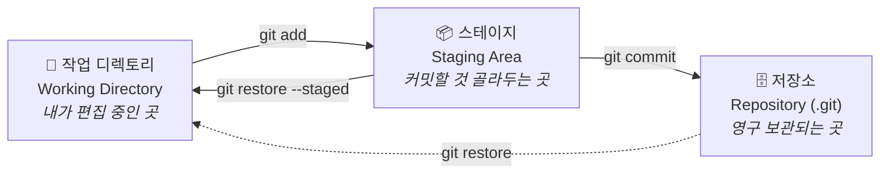
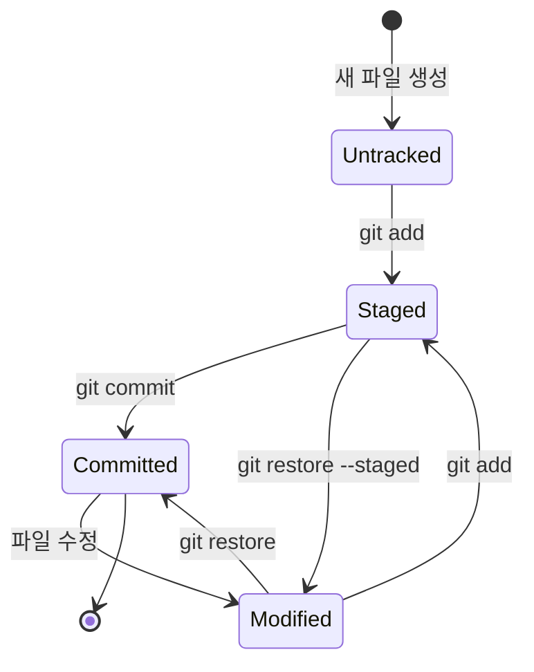
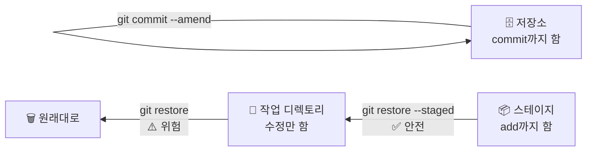
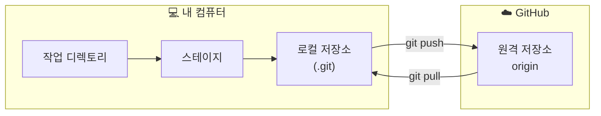
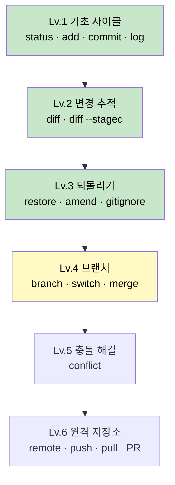

# 🌱 Git 연습장

> 명령어를 **외우는** 곳이 아니라, 왜 그렇게 동작하는지 **손으로 익히는** 저장소입니다.

Windows 11 / cmd 환경에서 Git을 처음부터 단계별로 학습한 기록입니다.
각 레벨은 독립된 문서로 되어 있어, 언제 어디서든 열어서 복습할 수 있습니다.

📍 **원격 저장소**: https://github.com/LeeHwon0217/git-study-notes

---

## 🧠 Git의 심장 — 3개의 구역

Git을 이해하는 열쇠는 이것 하나입니다. **파일이 3개의 구역을 옮겨 다닌다.**



> 🔑 **가장 중요한 사실: 같은 파일이 세 곳에 따로 존재합니다.**
> "파일은 하나"라고 생각하면 `restore` 계열 명령이 절대 이해되지 않습니다.

```
📝 작업 디렉토리 : 사과 바나나 포도 딸기 🍓   ← VSCode에 보이는 것
📦 스테이지      : 사과 바나나 포도          ← 눈에 안 보임
🗄️ 저장소        : 사과 바나나 포도          ← 커밋된 것
```

세 칸을 직접 들여다보는 명령:

```bash
type 파일명                  # 작업 디렉토리 (cmd) / cat 파일명 (bash)
git show :파일명             # 스테이지
git show HEAD:파일명         # 저장소 (최신 커밋)
```

**사진 찍기 비유:**

| 단계 | 비유 | 명령어 |
|:--|:--|:--|
| 작업 디렉토리 | 사람들이 여기저기 흩어져 있음 | (그냥 파일 편집) |
| 스테이지 | 찍을 사람만 카메라 앞에 세움 | `git add` |
| 저장소 | 📸 **찰칵** — 영구 보존 | `git commit` |

> 💡 `add`와 `commit`이 왜 나뉘어 있냐면 — 파일 5개를 고쳤어도
> 그중 3개만 골라서 하나의 의미 있는 커밋으로 묶을 수 있게 하기 위해서입니다.

---

## 🔄 파일의 상태 전이도



| 상태 | `git status`에 보이는 문구 | 뜻 |
|:--|:--|:--|
| 🔴 **Untracked** | `Untracked files` | Git이 존재를 알지만 관리는 안 함 |
| 🟡 **Modified** | `Changes not staged for commit` | 관리 중인데 수정됨, `add` 안 함 |
| 🟢 **Staged** | `Changes to be committed` | 커밋 대기 중 |
| ⚪ **Committed** | `working tree clean` | 저장 완료 |

> `git status` 출력의 **괄호 안내를 읽으세요.** Git이 다음에 칠 명령을 직접 알려줍니다.
> 막혔을 때 답의 절반은 거기 있습니다.

---

## 🔍 `diff` 두 형제 — 어느 구간을 보는가

```
  작업 디렉토리          스테이지            저장소
       │                   │                  │
       └─── git diff ──────┘                  │
       │                   └ git diff --staged┘
       │                                      │
       └────────── git diff HEAD ─────────────┘
```

| 명령 | 비교 구간 | 답해주는 질문 |
|:--|:--|:--|
| `git diff` | 작업 디렉토리 ↔ 스테이지 | "아직 `add` 안 한 게 뭐지?" |
| `git diff --staged` | 스테이지 ↔ 저장소 | "이번에 커밋되면 뭐가 들어가지?" |
| `git diff HEAD` | 작업 디렉토리 ↔ 저장소 | "마지막 커밋 이후 전부 뭐가 바뀌었지?" |

**`add` 직후 `git diff`가 빈 화면인 건 정상입니다.** 변경이 뒤 구간으로 넘어갔을 뿐.

### diff 읽는 법 — 맨 앞 한 글자만 보세요

```
 기초 미션은 문서에 정리되어 있습니다.     ← 공백 = 안 바뀐 줄 (문맥)
-- [ ] 미션 1 — 첫 커밋                  ← -   = 삭제된 줄
+- [x] 미션 1 — 첫 커밋                  ← +   = 추가된 줄
```

⚠️ `--`가 두 개로 보이죠? **첫 글자는 Git이 붙인 기호, 둘째 글자부터가 진짜 파일 내용**입니다.

---

## 🔙 되돌리기 지도 — "어디까지 갔지?"

실수한 **지점**에 따라 쓰는 명령이 다릅니다.



| 실수한 지점 | 명령 | 결과 |
|:--|:--|:--|
| 파일만 수정함 | `git restore <파일>` | 수정 내용이 **영구 삭제** ⚠️ |
| `add`까지 함 | `git restore --staged <파일>` | `add`만 취소, 수정은 **남음** ✅ |
| `commit`까지 함 | `git commit --amend -m "..."` | 커밋을 **새로 만들어 교체** (해시 바뀜) |

> 🔑 **한 줄 요약**
> **`--staged` 있으면 = `add` 취소 (안전)**
> **`--staged` 없으면 = 내 작업 내용 삭제 (위험)**
>
> 둘 다 "오른쪽 칸을 왼쪽 칸으로 복사해 덮어쓰기"이고, **어느 칸에서 어느 칸으로**만 다릅니다.

```
git restore --staged 파일   :  저장소 ──> 스테이지       (작업 파일 안 건드림)
git restore 파일            :  스테이지 ──> 작업 디렉토리  (내 수정 증발)
```

⚠️ **`--amend`는 이미 `push`한 커밋에 쓰지 마세요.** 해시가 바뀌어 남의 히스토리와 어긋납니다.

---

## ☁️ 로컬과 원격



**`commit`은 내 컴퓨터에만 저장합니다.** GitHub에 올라가려면 반드시 `push`가 필요해요.

### 신호등 읽기 — `git status` 첫 줄

| 문구 | 뜻 |
|:--|:--|
| `up to date with 'origin/main'` | 🟢 로컬과 GitHub이 같음 |
| `ahead of 'origin/main' by N commits` | 🟡 안 올린 커밋이 N개 → `git push` |
| `behind 'origin/main' by N commits` | 🔵 안 받은 변경이 N개 → `git pull` |

`git log --oneline`의 **`(origin/main)` 라벨**도 같은 정보입니다.
그 라벨 위로 쌓인 커밋이 아직 안 올린 것.

---

## 📚 레벨 로드맵



| 레벨 | 주제 | 문서 | 상태 |
|:--:|:--|:--|:--:|
| 1 | 기초 사이클 | [levels/01-basics.md](levels/01-basics.md) | ✅ 완료 |
| 2 | 변경 추적 (diff) | [levels/02-diff.md](levels/02-diff.md) | ✅ 완료 |
| 3 | 되돌리기 | [levels/03-undo.md](levels/03-undo.md) | ✅ 완료 |
| 4 | 브랜치와 병합 | [levels/04-branch.md](levels/04-branch.md) | 🔜 **다음** |
| 5 | 충돌 해결 | [levels/05-conflict.md](levels/05-conflict.md) | ⬜ |
| 6 | 원격 저장소 | [levels/06-remote.md](levels/06-remote.md) | 🚧 push까지 완료 |

---

## ⚡ 치트시트

### 매일 쓰는 것

```bash
git status                    # 지금 상황 보고서 (제일 자주 씀)
git add <파일>                 # 스테이지에 올리기
git add .                     # 변경된 것 전부 올리기
git commit -m "메시지"          # 커밋 만들기
git push                      # GitHub에 올리기 (-u 한 번 했으면 이것만)
git pull                      # GitHub에서 받아오기
```

### 살펴보기

```bash
git diff                      # 아직 add 안 한 변경
git diff --staged             # 커밋될 내용 미리보기 ← 커밋 직전 습관!
git log --oneline             # 히스토리 한 줄 요약
git log --oneline --graph --all   # 브랜치 구조를 그래프로
git log -3                    # 최근 3개만
git show                      # 최근 커밋의 실제 변경 내용
git show :파일                 # 스테이지에 있는 사본
git show HEAD:파일             # 저장소에 있는 사본
```

### 실수했을 때

```bash
git restore <파일>             # 수정 버리기 (add 전) ⚠️
git restore --staged <파일>    # add 취소 (수정은 남음) ✅
git commit --amend -m "새 메시지"  # 방금 커밋 메시지 고치기
git rm --cached <파일>         # 추적만 끊기 (파일은 남음)
git merge --abort             # 충돌 상황에서 도망치기
```

### 브랜치 (Lv.4 예정)

```bash
git branch                    # 목록 (* 가 현재 위치)
git switch -c <이름>           # 만들면서 이동
git switch main               # 이동
git merge <이름>               # 현재 브랜치에 합치기
git branch -d <이름>           # 삭제
```

---

## 🪟 Windows(cmd) 환경 설정

한글 경로/파일명 때문에 실제로 겪은 문제와 해결책입니다.

| 증상 | 해결 |
|:--|:--|
| 파일명이 `\354\227\260...` 로 보임 | `git config --global core.quotepath false` |
| 파일명이 `?곗뒿_誘몄뀡` 로 깨짐 | `chcp 65001` (터미널 창마다 매번) |
| `log`/`diff` 출력에 잔상이 겹침 | `git config --global core.pager cat` |
| `LF will be replaced by CRLF` 경고 | **무시해도 됨.** 줄바꿈 문자 자동 변환 안내 |
| `'cat' is not recognized` | cmd엔 Unix 명령이 없음. Git Bash 터미널을 쓰면 해결 |
| `fatal: ambiguous argument 'oneline'` | **`--` 두 개**를 빼먹은 것. `git log --oneline` |

### cmd 파일 조작

| 명령 | 뜻 | 위험도 |
|:--|:--|:--|
| `echo 내용 > 파일` | 새로 만들기 / **덮어쓰기** | ⚠️ 기존 내용 날아감 |
| `echo 내용 >> 파일` | 끝에 **이어 붙이기** | ✅ 안전 |
| `type 파일` | 내용 보기 (Unix의 `cat`) | — |

> 💡 **근본 해결**: VSCode 터미널을 **Git Bash**로 바꾸면 위 문제 대부분이 사라집니다.

---

## 🗂️ 저장소 구조

```
Git 연습/
├── README.md              ← 지금 이 문서 (전체 지도)
├── CLAUDE.md              ← AI 조수용 규칙 (대신 실행 금지 등)
├── .gitignore             ← 추적 제외 명단
├── practice.txt           ← 되돌리기 실습용 (사과·바나나·포도·딸기)
├── secret.txt             ← 🚫 .gitignore로 제외됨. GitHub엔 안 올라감
└── levels/
    ├── 01-basics.md       ✅ 기초 사이클
    ├── 02-diff.md         ✅ 변경 추적
    ├── 03-undo.md         ✅ 되돌리기
    ├── 04-branch.md       🔜 브랜치와 병합
    ├── 05-conflict.md     ⬜ 충돌 해결
    └── 06-remote.md       🚧 원격 저장소
```

> 📌 파일명을 영문으로 지은 이유: 한글 파일명은 Windows에서 인코딩 문제를 일으킵니다.
> 실무에서도 파일·폴더명은 영문 소문자와 하이픈을 쓰는 것이 관례입니다.

---

## 📈 학습 로그

실제로 쌓은 커밋들입니다. `git log --oneline`으로 언제든 확인할 수 있습니다.

| 커밋 | 메시지 | 배운 것 |
|:--|:--|:--|
| `327caa0` | 첫 커밋: 프로젝트 가이드 추가 | `init` · `add` · `commit` · **root-commit** |
| `c6eaa99` | 학습 노트를 레벨별 구조로 재편성 | `add .` · 폴더 통째로 커밋 |
| `a35349f` | 원격 저장소 주소 기록 | `remote add` · `push -u` · **첫 GitHub 업로드** |
| `5e1119d` | 되돌리기 연습용 파일 추가 | cmd `>` vs `>>` |
| `51608b7` | 딸기 추가 | `restore` · `restore --staged` · **`--amend`로 해시 교체** |
| `8dc2899` | .gitignore 추가 | 추적 제외 |
| `41244a6` | Lv.3 되돌리기 학습 기록 | — |

> `51608b7`은 원래 `2a8bb6f`였습니다. `--amend`로 메시지를 고치자 해시가 통째로 바뀌었어요.
> **커밋 수정 = 새 커밋으로 교체**라는 증거입니다.
