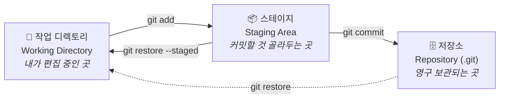
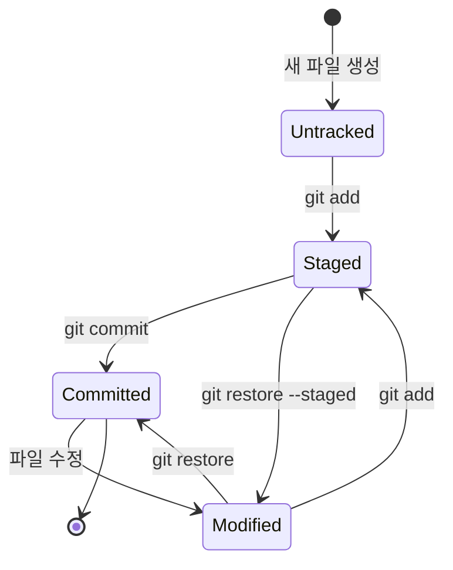
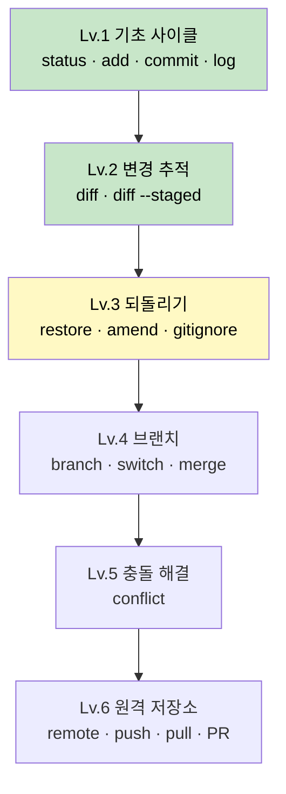

# 🌱 Git 연습장

> 명령어를 **외우는** 곳이 아니라, 왜 그렇게 동작하는지 **손으로 익히는** 저장소입니다.

Windows 11 / cmd 환경에서 Git을 처음부터 단계별로 학습한 기록입니다.
각 레벨은 독립된 문서로 되어 있어, 언제 어디서든 열어서 복습할 수 있습니다.

---

## 🧠 Git의 심장 — 3개의 구역

Git을 이해하는 열쇠는 이것 하나입니다. **파일이 3개의 구역을 옮겨 다닌다.**



**사진 찍기에 비유하면:**

| 단계 | 비유 | 명령어 |
|:--|:--|:--|
| 작업 디렉토리 | 사람들이 여기저기 흩어져 있음 | (그냥 파일 편집) |
| 스테이지 | 찍을 사람만 카메라 앞에 세움 | `git add` |
| 저장소 | 📸 **찰칵** — 영구 보존 | `git commit` |

> 💡 `add`와 `commit`이 왜 나뉘어 있냐면 — 파일 5개를 고쳤어도
> 그중 3개만 골라서 하나의 의미 있는 커밋으로 묶을 수 있게 하기 위해서입니다.

---

## 🔄 파일의 상태 전이도

파일 하나가 겪는 일생입니다.



| 상태 | `git status`에 보이는 문구 | 뜻 |
|:--|:--|:--|
| 🔴 **Untracked** | `Untracked files` | Git이 존재를 알지만 관리는 안 함 |
| 🟡 **Modified** | `Changes not staged for commit` | 관리 중인데 수정됨, `add` 안 함 |
| 🟢 **Staged** | `Changes to be committed` | 커밋 대기 중 |
| ⚪ **Committed** | (아무것도 안 뜸 / `clean`) | 저장 완료 |

> `git status`의 출력이 **텅 비어 있으면(clean) 가장 좋은 상태**입니다.

---

## 🔍 `diff` 두 형제 — 어느 구간을 보는가

초보자가 가장 많이 헷갈리는 부분입니다.

```
  작업 디렉토리          스테이지            저장소
       │                   │                  │
       └─── git diff ──────┘                  │
       │                   └ git diff --staged┘
       │                                      │
       └────────── git diff HEAD ─────────────┘
```

| 명령 | 비교 구간 | 답해주는 질문 |
|:--|:--|:--|
| `git diff` | 작업 디렉토리 ↔ 스테이지 | "아직 `add` 안 한 게 뭐지?" |
| `git diff --staged` | 스테이지 ↔ 저장소 | "이번에 커밋되면 뭐가 들어가지?" |
| `git diff HEAD` | 작업 디렉토리 ↔ 저장소 | "마지막 커밋 이후 전부 뭐가 바뀌었지?" |

**`add` 직후 `git diff`가 빈 화면인 건 정상입니다.** 변경이 스테이지로 넘어갔으니까요.

### diff 읽는 법 — 맨 앞 한 글자만 보세요

```
 기초 미션은 문서에 정리되어 있습니다.     ← 공백 = 안 바뀐 줄 (문맥)
-- [ ] 미션 1 — 첫 커밋                  ← -   = 삭제된 줄
+- [x] 미션 1 — 첫 커밋                  ← +   = 추가된 줄
```

⚠️ 위에서 `--`가 두 개로 보이죠? **첫 글자는 Git이 붙인 기호, 둘째 글자부터가 진짜 파일 내용**입니다.
(파일 내용이 마크다운 목록 `- [ ]` 이라 `-`가 겹친 것)

---

## 📚 레벨 로드맵



| 레벨 | 주제 | 문서 | 상태 |
|:--:|:--|:--|:--:|
| 1 | 기초 사이클 | [levels/01-basics.md](levels/01-basics.md) | ✅ 완료 |
| 2 | 변경 추적 (diff) | [levels/02-diff.md](levels/02-diff.md) | ✅ 완료 |
| 3 | 되돌리기 | [levels/03-undo.md](levels/03-undo.md) | 🔜 다음 |
| 4 | 브랜치와 병합 | [levels/04-branch.md](levels/04-branch.md) | ⬜ |
| 5 | 충돌 해결 | [levels/05-conflict.md](levels/05-conflict.md) | ⬜ |
| 6 | 원격 저장소 | [levels/06-remote.md](levels/06-remote.md) | ⬜ |

---

## ⚡ 치트시트

### 매일 쓰는 것

```bash
git status                    # 지금 상황 보고서 (제일 자주 씀)
git add <파일>                 # 스테이지에 올리기
git add .                     # 변경된 것 전부 올리기
git commit -m "메시지"          # 커밋 만들기
git log --oneline             # 히스토리 한 줄 요약
git diff                      # 아직 add 안 한 변경 보기
git diff --staged             # 커밋될 내용 미리보기
```

### 실수했을 때

```bash
git restore <파일>             # 수정 내용 버리기 (add 전)
git restore --staged <파일>    # add 취소 (수정은 남음)
git commit --amend -m "새 메시지"  # 방금 커밋 메시지 고치기
```

### 살펴보기

```bash
git show                      # 최근 커밋의 실제 변경 내용
git log --oneline --graph --all   # 브랜치 구조를 그래프로
git log -3                    # 최근 3개만
```

---

## 🪟 Windows(cmd) 환경 설정

한글 경로/파일명 때문에 겪은 문제와 해결책입니다.

| 증상 | 해결 |
|:--|:--|
| 파일명이 `\354\227\260...` 로 보임 | `git config --global core.quotepath false` |
| 파일명이 `?곗뒿_誘몄뀡` 로 깨짐 | `chcp 65001` (터미널 창마다 매번) |
| `log`/`diff` 출력에 잔상이 겹침 | `git config --global core.pager cat` |
| `LF will be replaced by CRLF` 경고 | **무시해도 됨.** 줄바꿈 문자 자동 변환 안내 |
| `'cat' is not recognized` | cmd엔 Unix 명령이 없음. Git Bash 터미널을 쓰면 해결 |

> 💡 **근본 해결**: VSCode 터미널을 **Git Bash**로 바꾸면 위 문제 대부분이 사라집니다.

---

## 🗂️ 저장소 구조

```
Git 연습/
├── README.md              ← 지금 이 문서 (전체 지도)
├── CLAUDE.md              ← AI 조수용 규칙 (대신 실행 금지 등)
└── levels/
    ├── 01-basics.md       ← 레벨별 학습 노트
    ├── 02-diff.md
    ├── 03-undo.md
    ├── 04-branch.md
    ├── 05-conflict.md
    └── 06-remote.md
```

> 📌 파일명을 영문으로 지은 이유: 한글 파일명은 Windows에서 인코딩 문제를 일으킵니다.
> 실무에서도 파일·폴더명은 영문 소문자와 하이픈을 쓰는 것이 관례입니다.
