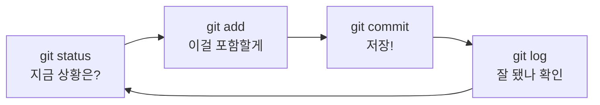

# Lv.1 — 기초 사이클 ✅

> `status` → `add` → `commit` → `log`
> Git으로 하는 모든 일의 뼈대. 이 4개가 전체의 80%입니다.

---

## 🎯 목표

파일 하나를 Git의 관리 아래로 넣고, 첫 커밋을 만든다.

## 🧭 흐름



---

## 📖 명령어별 정리

### `git init` — 저장소 만들기

```bash
git init -b main
```

폴더에 `.git`이라는 **숨김 폴더**를 만듭니다. 이 안에 모든 히스토리가 들어갑니다.
`-b main`은 기본 브랜치 이름을 `main`으로 지정하는 옵션 (안 쓰면 `master`가 될 수 있음).

> ⚠️ `.git` 폴더를 지우면 **모든 히스토리가 사라집니다.** 절대 건드리지 마세요.

### `git status` — 상황 보고서

> "Git이 마지막으로 기억하는 모습과 비교해서, 지금 내 폴더는 뭐가 달라졌지?"

**두 가지 성질:**
1. **아무것도 바꾸지 않습니다.** 몇 번을 쳐도 안전 → 불안하면 그냥 치세요
2. **다음에 뭘 할지 알려줍니다.** 출력의 `(use "git add <file>..." to ...)` 괄호 안내를 읽는 습관을 들이세요

🚗 비유: **자동차 계기판.** 운전을 하진 않지만, 운전 전에 항상 보는 것.

### `git add` — 스테이지에 올리기

```bash
git add CLAUDE.md      # 특정 파일
git add .              # 현재 폴더의 변경 전부
```

아직 **저장되는 건 없습니다.** "다음 커밋에 이걸 포함하겠다"는 예약일 뿐.

### `git commit` — 셔터 누르기

```bash
git commit -m "첫 커밋: 프로젝트 가이드 추가"
```

`-m`은 **m**essage의 약자. 생략하면 편집기가 열려 초보자가 갇히기 쉬우니 **항상 `-m`을 붙이세요.**

커밋 = 스테이지 내용의 **스냅샷**. 한 번 만들어지면 그 시점 상태가 영구 보존됩니다.

### `git log` — 역사 보기

```bash
git log                # 자세히
git log --oneline      # 한 줄 요약
git log -3             # 최근 3개만
```

---

## 🧪 실습 기록

### 첫 커밋 결과

```
[main (root-commit) 327caa0] 첫 커밋: 프로젝트 가이드 추가
 1 file changed, 71 insertions(+)
 create mode 100644 CLAUDE.md
```

| 조각 | 뜻 |
|:--|:--|
| `main` | main 브랜치에 만들어짐 |
| `root-commit` | **최초 커밋.** 부모가 없어서 특별 표시. 저장소당 딱 한 번만 봄 |
| `327caa0` | 커밋의 **고유 ID(해시).** "그 시점으로 돌아가자" 할 때 쓰는 주소 |
| `1 file changed, 71 insertions(+)` | 파일 1개, 71줄 추가 |

### `git log` 결과

```
commit 327caa0d9040f92f180fe951fa16e4fddf8b5e6a (HEAD -> main)
Author: LeeHwon0217 <hubo0217@naver.com>
Date:   Sun Sep 6 23:06:16 2026 +0900

    첫 커밋: 프로젝트 가이드 추가
```

**① 해시 `327caa0d...5e6a`**
아까 본 `327caa0`은 40자리 중 앞 7자리만 보여준 것. 이 ID는 **커밋 내용으로부터 계산**되므로,
내용이 1글자만 달라도 완전히 다른 값이 나옵니다. → Git이 변조를 감지할 수 있는 이유.

**② `(HEAD -> main)`**
`HEAD`는 **"내가 지금 서 있는 위치"** 표시. 지금은 main 브랜치의 최신 커밋을 보는 중.
브랜치(Lv.4)를 배우면 이 `HEAD`가 이리저리 움직이는 걸 보게 됩니다.

---

## 💡 이 레벨의 핵심 깨달음

**Git은 폴더를 통째로 저장하지 않는다. 내가 `add`로 고른 것만 저장한다.**

실습에서 파일이 2개(`CLAUDE.md`, `연습_미션.md`) 있었지만 하나만 `add` 하고 커밋했더니,
커밋 후에도 나머지 하나는 여전히 `Untracked`로 남아 있었습니다. 이게 증거입니다.

---

## ⚠️ 자주 하는 실수

| 실수 | 증상 | 해결 |
|:--|:--|:--|
| `add` 없이 `commit` | `nothing added to commit` | 먼저 `git add` |
| `-m` 빼먹음 | 낯선 편집기가 열림 | `Esc` → `:q!` → Enter 로 탈출 후 `-m` 붙여 재시도 |
| `.git` 폴더 삭제 | 히스토리 전멸 | 복구 불가. 절대 건드리지 말 것 |

---

➡️ 다음: [Lv.2 — 변경 추적](02-diff.md)
