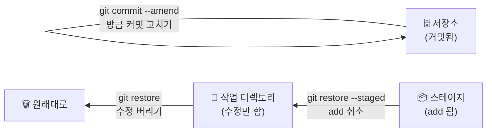

# Lv.3 — 되돌리기 🔜

> Git이 무서운 이유는 "잘못 건드리면 못 돌아갈까 봐"입니다.
> 이 레벨을 끝내면 **되돌릴 수 있다는 확신**이 생깁니다.

---

## 🎯 목표

실수한 지점이 **어느 구역인지**에 따라 다른 명령을 쓴다는 것을 익힌다.

## 🧭 되돌리기 지도



**질문 하나로 결정됩니다: "어디까지 갔지?"**

| 실수한 지점 | 명령 | 결과 |
|:--|:--|:--|
| 파일만 수정함 | `git restore <파일>` | 수정 내용이 **사라짐** ⚠️ |
| `add`까지 함 | `git restore --staged <파일>` | 스테이지에서만 내려옴, 수정은 **남음** |
| `commit`까지 함 | `git commit --amend` | 방금 커밋을 새로 씀 |

---

## 📖 실습 시나리오

### (1) 아직 `add` 안 한 수정 버리기

```bash
# 파일을 아무렇게나 망쳐놓고 저장한 뒤
git status                 # "Changes not staged" 확인
git diff                   # 뭘 망쳤는지 확인
git restore 파일명          # 되돌리기
git status                 # 깨끗해짐
```

> ⚠️ **주의: 이건 진짜로 사라집니다.** 커밋 안 한 내용은 Git이 기억하지 못해요.
> `restore` 전에 `git diff`로 뭘 버리는지 꼭 확인하세요.

### (2) `add` 취소하기

```bash
git add 파일명
git status                       # "Changes to be committed"
git restore --staged 파일명       # 스테이지에서 내리기
git status                       # "Changes not staged" 로 돌아옴
```

**수정 내용은 그대로 남습니다.** 카메라 앞에 세웠던 사람을 다시 자리로 돌려보낸 것뿐.

### (3) 방금 한 커밋 고치기

```bash
git commit -m "오타가 잇는 메시지"
git log --oneline
git commit --amend -m "오타가 있는 메시지"
git log --oneline               # 해시가 바뀐 것에 주목!
```

> ⚠️ `--amend`는 커밋을 **수정**하는 게 아니라 **새로 만들어 갈아끼우는** 것입니다.
> 그래서 해시가 바뀝니다. **남과 공유한(push한) 커밋에는 쓰지 마세요.**

---

## 📖 `.gitignore` — 애초에 추적 안 하기

비밀번호, 로그, 빌드 결과물처럼 **버전 관리하면 안 되는 파일**을 제외합니다.

```bash
echo 비밀번호123 > secret.txt
git status                       # secret.txt 가 뜸

echo secret.txt > .gitignore
git status                       # 사라짐! 대신 .gitignore 가 뜸

git add .gitignore
git commit -m ".gitignore 추가"
```

### 자주 쓰는 패턴

```gitignore
secret.txt        # 특정 파일
*.log             # 확장자 전체
node_modules/     # 폴더 통째로
.env              # 환경변수 (API 키 등) — 가장 중요!
```

> 🔥 **실무에서 제일 중요한 파일 중 하나입니다.**
> API 키를 GitHub에 올렸다가 사고 나는 경우가 정말 많아요.
> ⚠️ 단, **이미 커밋된 파일은 `.gitignore`에 넣어도 계속 추적됩니다.**
> 그땐 `git rm --cached 파일명`으로 추적을 먼저 끊어야 합니다.

---

## ⚠️ 헷갈리기 쉬운 것

| 명령 | 하는 일 |
|:--|:--|
| `git restore 파일` | 수정 **버리기** (위험) |
| `git restore --staged 파일` | `add`만 **취소** (안전) |
| `git rm --cached 파일` | Git 추적만 끊기, 파일은 남음 |
| `git rm 파일` | 파일 **삭제** + 추적 끊기 |

---

⬅️ 이전: [Lv.2 — 변경 추적](02-diff.md)   ·   ➡️ 다음: [Lv.4 — 브랜치](04-branch.md)
