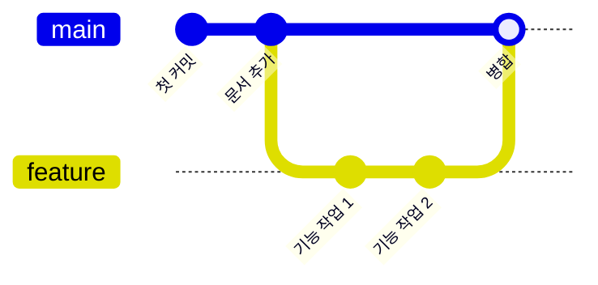

# Lv.4 — 브랜치와 병합 ⬜

> Git이 진짜 강력해지는 지점. **여러 갈래의 작업을 동시에** 진행하는 법.

---

## 🎯 목표

브랜치를 만들어 작업하고, 다시 main으로 합친다.

## 🧭 브랜치란?

**커밋을 가리키는 이름표**입니다. 폴더 복사가 아니에요.



**왜 쓰냐면** — main은 항상 정상 동작하는 상태로 두고,
새 기능은 별도 갈래에서 실험하다가, 완성되면 합치기 위해서입니다.
망해도 그 브랜치만 버리면 main은 무사합니다.

---

## 📖 명령어

```bash
git branch                    # 브랜치 목록 (* 가 현재 위치)
git branch feature            # feature 브랜치 만들기
git switch feature            # feature 로 이동
git switch -c feature         # 만들면서 바로 이동 (자주 씀)
git switch main               # main 으로 복귀

git merge feature             # (main 에서) feature 를 main 으로 합치기
git branch -d feature         # 다 쓴 브랜치 삭제
```

> 💡 `git checkout`도 같은 일을 하지만, 기능이 너무 많아 헷갈립니다.
> 신형인 **`switch`(이동)** 와 **`restore`(되돌리기)** 를 쓰세요.

---

## 🧪 실습 시나리오

```bash
git switch -c feature-hello       # 1. 새 갈래 만들고 이동
git branch                        # 2. * 가 feature-hello 에 있는지 확인

# 3. 파일 하나 만들거나 수정하고
git add .
git commit -m "인사말 추가"

git switch main                   # 4. main 으로 돌아가기
# 👀 파일이 사라진 것처럼 보임! → 정상. 다른 갈래의 작업이니까

git merge feature-hello           # 5. 합치기
# 👀 파일이 돌아옴

git log --oneline --graph --all   # 6. 그래프로 확인
git branch -d feature-hello       # 7. 정리
```

> 🔑 4번에서 **파일이 사라진 것처럼 보이는 경험**이 이 레벨의 핵심입니다.
> 브랜치를 옮기면 작업 폴더의 내용이 그 브랜치의 마지막 커밋 상태로 **통째로 교체**됩니다.

---

## 📖 병합의 두 가지 방식

| 방식 | 언제 | 결과 |
|:--|:--|:--|
| **Fast-forward** | main이 그동안 안 변했을 때 | 이름표만 앞으로 이동. 깔끔 |
| **3-way merge** | main도 그동안 변했을 때 | **병합 커밋**이 새로 생김 |

```
Fast-forward:     A──B──C(main, feature)

3-way merge:      A──B────D──M(main)
                      └─C──┘
```

---

⬅️ 이전: [Lv.3 — 되돌리기](03-undo.md)   ·   ➡️ 다음: [Lv.5 — 충돌 해결](05-conflict.md)
