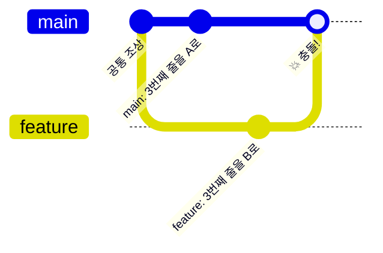

# Lv.5 — 충돌 해결 ⬜

> 초보자가 가장 무서워하는 것. 사실은 **Git이 "여기는 사람이 판단해줘" 하고 물어보는 것**뿐입니다.

---

## 🎯 목표

일부러 충돌을 내고, 손으로 해결해서 병합을 완료한다.

## 🧭 충돌은 왜 나는가



**두 브랜치가 같은 파일의 같은 줄을 다르게 고쳤을 때** 발생합니다.
Git은 *"A가 맞아, B가 맞아? 난 모르겠어"* 하고 사람에게 넘깁니다.

> 🔑 **다른 줄을 고쳤으면 충돌 안 납니다.** Git이 알아서 합쳐요.
> Lv.2에서 배운 "Git은 줄 단위로 기록한다"가 여기서 이어집니다.

---

## 📖 충돌 표시 읽는 법

충돌이 나면 파일 안이 이렇게 바뀝니다:

```
<<<<<<< HEAD
안녕하세요 (main 에서 쓴 내용)
=======
반갑습니다 (feature 에서 쓴 내용)
>>>>>>> feature
```

| 기호 | 뜻 |
|:--|:--|
| `<<<<<<< HEAD` | 여기부터 **현재 브랜치(내가 서 있는 곳)** 의 내용 |
| `=======` | 경계선 |
| `>>>>>>> feature` | 여기까지 **합치려는 브랜치** 의 내용 |

### 해결 방법

**편집기로 파일을 열어서, `<<<<<<<` `=======` `>>>>>>>` 세 줄을 모두 지우고
남기고 싶은 최종 형태로 직접 고쳐 쓰면 됩니다.**

셋 중 하나를 고르는 게 아니라 — 둘을 섞어서 새로 쓸 수도 있습니다. 사람이 판단하는 겁니다.

---

## 🧪 실습 시나리오

```bash
# 1. 준비 — main 에서 파일 만들고 커밋
git switch main
# hello.txt 에 "안녕" 이라고 쓰고 저장
git add . && git commit -m "인사말 추가"

# 2. 브랜치에서 같은 줄 수정
git switch -c fix-greeting
# hello.txt 의 "안녕" 을 "반가워" 로 수정
git add . && git commit -m "인사말 수정 (브랜치)"

# 3. main 에서도 같은 줄 수정
git switch main
# hello.txt 의 "안녕" 을 "헬로" 로 수정
git add . && git commit -m "인사말 수정 (main)"

# 4. 💥 병합 시도
git merge fix-greeting
# → CONFLICT (content): Merge conflict in hello.txt

# 5. 상황 파악
git status              # "Unmerged paths" 로 충돌 파일 목록이 뜸

# 6. 파일을 편집기로 열어 직접 해결 (<<<<<<< 등 제거)

# 7. 해결 완료 선언
git add hello.txt       # ← add 가 "해결했다"는 신호
git commit              # 병합 커밋 완성 (메시지는 자동 작성됨)

git log --oneline --graph --all
```

---

## 🆘 도망치는 법

충돌 상황이 감당 안 될 때:

```bash
git merge --abort       # 병합 시도 전으로 완전 복귀
```

**아무 일도 없었던 것처럼 되돌아갑니다.** 이 명령을 알아두면 충돌이 훨씬 덜 무섭습니다.

---

## 💡 핵심 깨달음

**충돌은 에러가 아니라 질문입니다.**

Git은 자동으로 합칠 수 없는 부분에서 멈추고 사람에게 물어보는 것뿐이에요.
그리고 `git add`가 *"내가 판단해서 해결했어"* 라는 대답입니다.

---

⬅️ 이전: [Lv.4 — 브랜치](04-branch.md)   ·   ➡️ 다음: [Lv.6 — 원격 저장소](06-remote.md)
