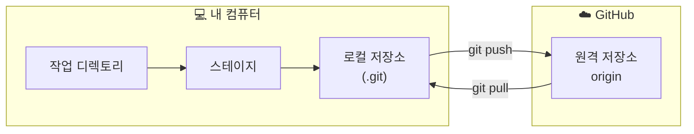

# Lv.6 — 원격 저장소 (GitHub) ⬜

> 지금까지는 전부 **내 컴퓨터 안**의 일이었습니다.
> 이제 인터넷의 저장소와 연결합니다.

---

## 🎯 목표

GitHub에 저장소를 만들고, 내 로컬 커밋을 밀어 올린다.

## 🧭 로컬과 원격의 관계



**중요**: `commit`은 **내 컴퓨터에만** 저장합니다. GitHub에 올라가려면 반드시 **`push`**가 필요해요.

| 용어 | 뜻 |
|:--|:--|
| **origin** | 원격 저장소의 기본 별명. "그 GitHub 주소"의 줄임말 |
| **push** | 로컬 커밋을 원격으로 밀어 올리기 |
| **pull** | 원격의 변경을 내려받아 합치기 |
| **clone** | 원격 저장소를 통째로 복제해 오기 |

---

## 📖 처음 연결하기 (지금 상황)

### 1단계 — GitHub에 빈 저장소 만들기

1. https://github.com/new 접속
2. **Repository name**: `git-practice` (원하는 이름)
3. **Public / Private** 선택 — 연습용이니 Private도 좋습니다
4. ⚠️ **"Add a README file" 체크 해제!** (이미 내 로컬에 파일이 있으므로)
5. **Create repository** 클릭

### 2단계 — 로컬과 연결하고 올리기

GitHub이 안내 화면에 명령어를 보여주는데, 그중 이것들입니다:

```bash
git remote add origin https://github.com/사용자명/git-practice.git
git remote -v                    # 연결 확인
git push -u origin main
```

| 명령 | 뜻 |
|:--|:--|
| `git remote add origin <URL>` | "이 주소를 `origin`이라고 부르겠다" 등록 |
| `git remote -v` | 등록된 원격 목록 확인 (`-v` = verbose) |
| `git push -u origin main` | main 브랜치를 origin으로 올리기 |

> 💡 `-u`는 `--set-upstream`. **딱 한 번만** 붙이면 됩니다.
> 이후로는 그냥 `git push`만 쳐도 어디로 보낼지 Git이 기억합니다.

### 3단계 — 인증

처음 `push`하면 로그인 창이 뜹니다.

- **브라우저 로그인 창이 뜨면** → GitHub 계정으로 로그인하면 끝
- **비밀번호를 물어보면** → ⚠️ 계정 비밀번호가 아니라 **Personal Access Token**이 필요합니다
  - GitHub → Settings → Developer settings → Personal access tokens → Tokens (classic)
  - Generate new token → `repo` 권한 체크 → 생성된 토큰을 비밀번호 자리에 붙여넣기

---

## 📖 이후의 일상

```bash
git add .
git commit -m "메시지"
git push                  # -u 를 한 번 했으면 이제 이것만
```

```bash
git pull                  # 다른 곳에서 바뀐 내용 받아오기
```

> 🔑 **작업 시작 전엔 `git pull`, 끝나면 `git push`.** 협업의 기본 리듬입니다.

---

## 📖 다른 저장소 가져오기

```bash
git clone https://github.com/사용자명/저장소이름.git
```

폴더가 통째로 생기고, `.git`과 히스토리까지 전부 복제됩니다.
`git init` + `git remote add`를 한 번에 한 것과 같아요.

---

## ⚠️ 주의사항

| 상황 | 설명 |
|:--|:--|
| **비밀 정보** | 한 번 push하면 삭제해도 히스토리에 남습니다. `.gitignore` (Lv.3)를 먼저! |
| **`push` 거부됨** | 원격에 내가 모르는 커밋이 있다는 뜻. `git pull` 먼저 하세요 |
| **`--force` push** | 원격 히스토리를 덮어씁니다. 혼자 쓰는 저장소가 아니면 쓰지 마세요 |

---

## 🎓 그다음 — Pull Request

혼자 쓸 땐 `push`로 충분하지만, 협업에서는:

```
브랜치 만들기 → 작업 → push → GitHub에서 Pull Request 생성
→ 동료가 리뷰 → 승인 → main에 merge
```

**PR은 "제 작업을 main에 넣어도 될까요?"라고 요청하는 절차**입니다.
코드 리뷰가 이루어지는 곳이자, 실무 Git 사용의 중심입니다.

---

⬅️ 이전: [Lv.5 — 충돌 해결](05-conflict.md)   ·   🏠 [처음으로](../README.md)
